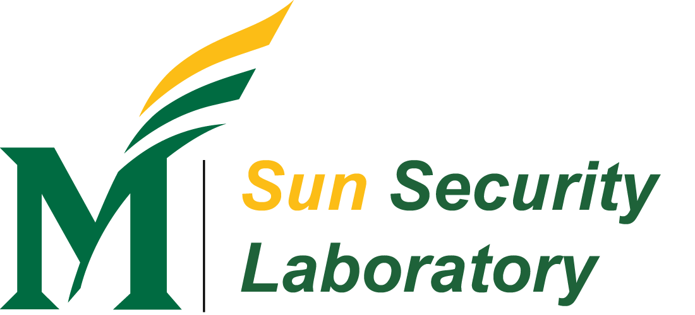

✨ **Welcome to Sun Security Laboratory (SunLab)!** ✨ 

SunLab is a security research lab built by Dr. Kun Sun at George Mason University, Fairfax, VA. \
Our research includes system security, network security, software security, and AI security. 

- 🔭 More info about SunLab >> [SunLab Website](https://sunlab-gmu.github.io), [Dr. Sun's Homepage](https://csis.gmu.edu/ksun/)
- 📫 Join in or cooperate with SunLab >> [contact SunLab](mailto:ksun3@gmu.edu)

“Live as if you were to die tomorrow. Learn as if you were to live forever.” –– Mahatma Gandhi
